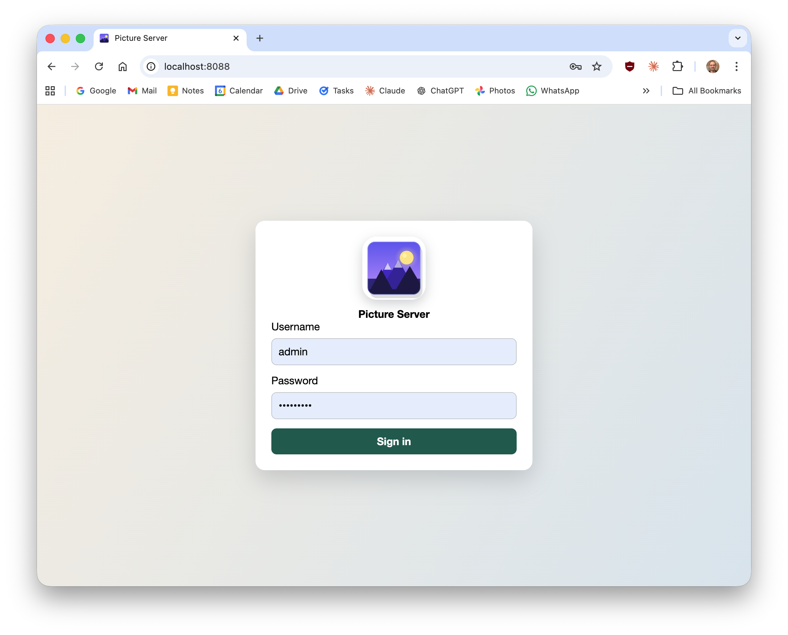
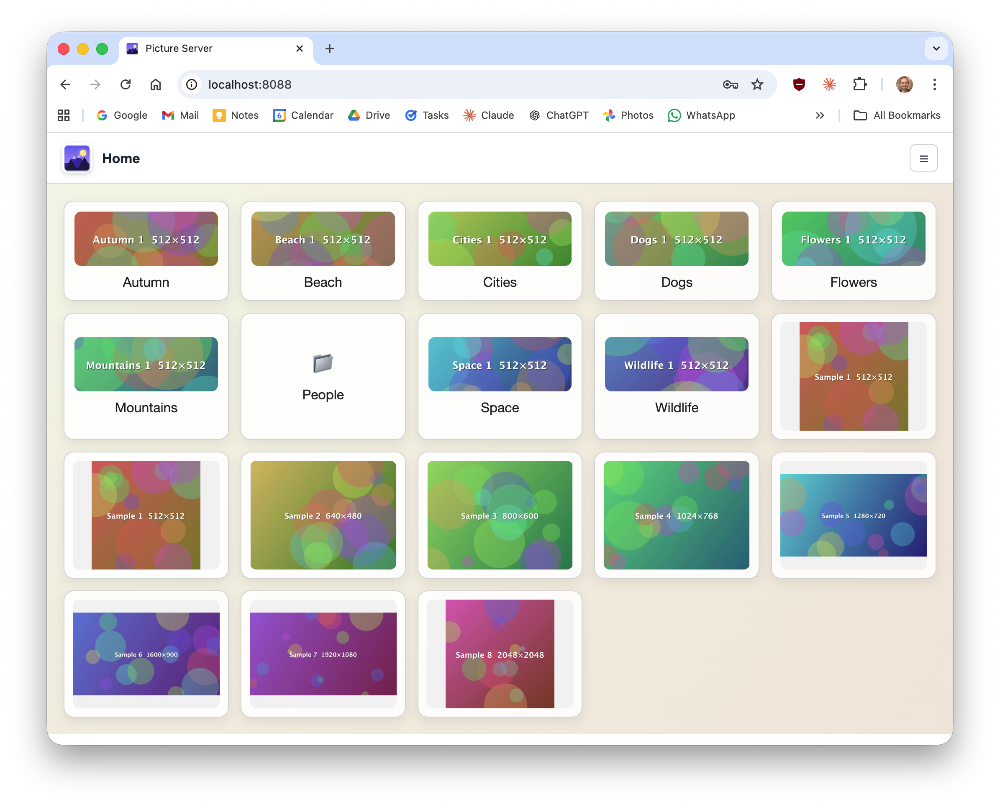
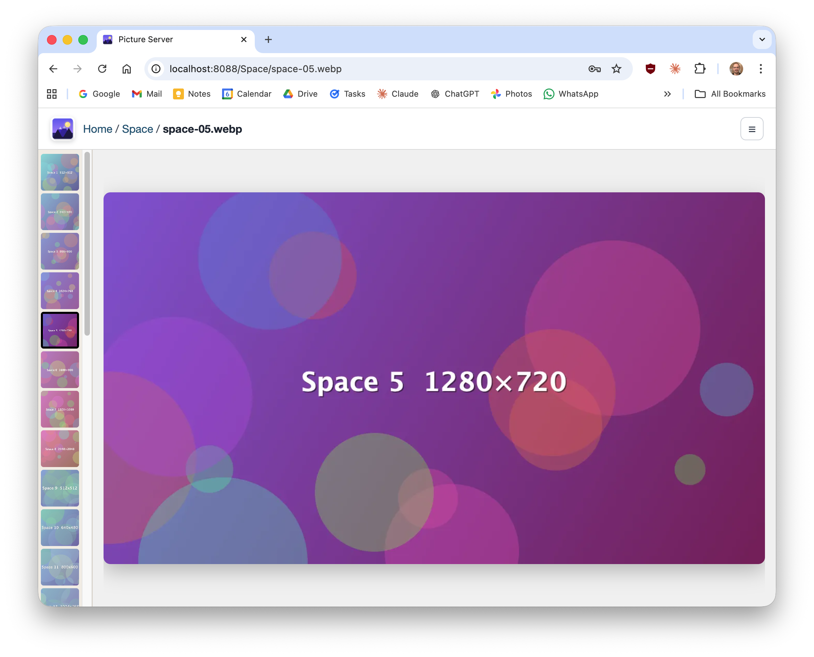

# Picture Server

**Picture Server** is a lightweight Java application that turns any local directory of images into a password-protected, album-style photo gallery accessible from any browser on your network. No cloud service, no database, no framework — just point it at a folder, set a password, and browse.

## Features

- **Album browsing** — navigates nested sub-directories as albums, with preview thumbnails on each tile
- **Picture viewer** — full-size image display with a thumbnail strip for quick navigation within an album
- **Password protection** — single-user login with a server-side session cookie; no credentials are stored in the browser
- **Zero dependencies at runtime** — embedded JDK HTTP server, no external process required
- **Broad image support** — serves JPEG, PNG, GIF, WebP, AVIF, and more

## Screenshots







## Configuration

Create `settings.properties` in the current working directory:

```properties
path = ./pictures
port = 8088
username = admin
password = secret
```

## Run

```bash
./gradlew run
```

## Test

```bash
./gradlew clean test
```
